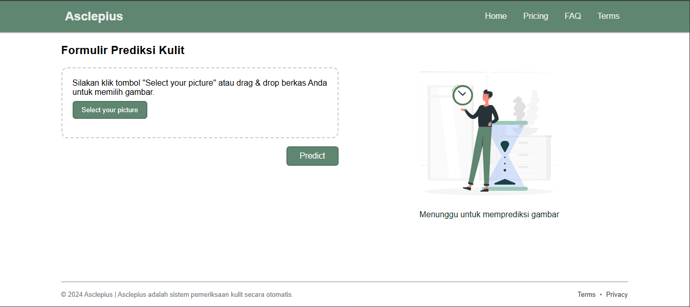

# Backend API With TensorFlow And Google Cloud

This is a project for the **"Belajar Penerapan Machine Learning dengan Google Cloud"** course from [Dicoding](https://www.dicoding.com/).  
This API acts as a bridge between the front end and the model deployed on Google Cloud to detect skin cancer.  
The expected outcome is a machine learning application capable of analyzing skin images and classifying them into two classes: **Cancer** and **Non-cancer**.

---

## Structured Files
      ├── img
      ├── src
      │   ├── server
      │   │   ├── handler.js
      │   │   ├── routes.js
      │   │   ├── server.js
      │   ├── services
      │   │   ├── getDataFromFirestore.js
      │   │   ├── inference.js
      │   │   ├── loadModel.js
      │   │   ├── storeData.js
      ├── .dockerignore
      ├── .env (hidden)
      ├── .gitignore
      ├── Dockerfile
      ├── package.json
      ├── package-lock.json
      ├── README.md
      
## API Endpoints Documentation

### 1. **Test Connection**
   **Endpoint:** `GET /`  
   **Description:** Test the API connection to ensure it is running.  
   **Response Example:**
  ```json
     {
         "status": "success",
         "message": "berhasil terkoneksi ke API"
     }

 ```

### 2. **Predict Data**
   **Endpoint:** `POST /predict`  
   **Description:** Predict the classification of an uploaded image using the deployed machine learning model.


   **Request Payload:** image (required): Image file in multipart/form-data format.
   
   **Response Example:**
  ```json
    {
    "status": "success",
    "message": "Model is predicted successfully",
    "data": {
        "id": "unique-id",
        "result": "Cancer",
        "suggestion": "Consult a doctor",
        "confidenceScore": 0.95,
        "createdAt": "2024-12-01T10:00:00Z"
    }
}


 ```

### 3. **Predict Data History**
   **Endpoint:** `GET /predict/histories`  
   **Description:** Retrieve all prediction histories from the firestore database.

   **Response Example:**
  ```json
   {
    "status": "success",
    "data": [
        {
            "id": "unique-id-1",
            "history": {
                "result": "Non-cancer",
                "createdAt": "2024-12-01T09:30:00Z",
                "suggestion": "Healthy",
                "id": "unique-id-1"
            }
        },
        {
            "id": "unique-id-2",
            "history": {
                "result": "Cancer",
                "createdAt": "2024-12-01T09:45:00Z",
                "suggestion": "Consult a doctor",
                "id": "unique-id-2"
            }
        }
    ]
}


 ```

## Our Technology

- **NodeJS**
- **HapiJS**
- **Docker**
- **TensorFlow JS**
- **Google Cloud Storage**
- **Google Cloud Firestore ( No SQL )**
- **Google Cloud App Engine**
- **Google Cloud Run**
- **Google Cloud IAM**

## Cloud Architecture
 


## Frontend UI


## Cancer Detection


## No Cancer Detection


## Postman Testing API


